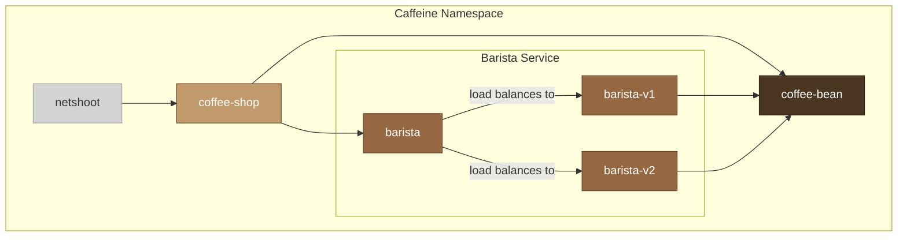
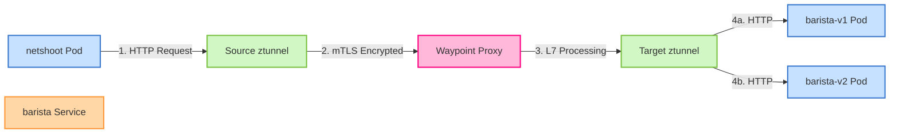
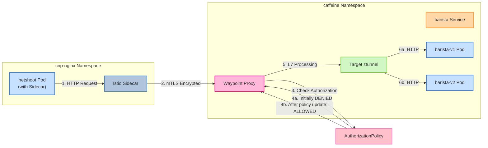
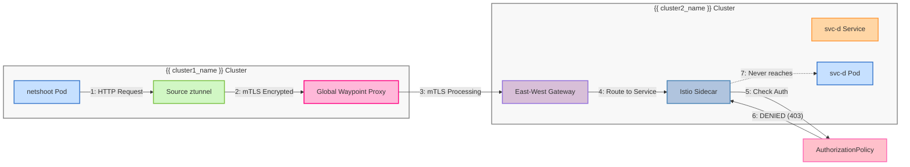

# Tetrate support of Istio clusters running in Ambient mode

[Tetrate support of Istio clusters running in Ambient mode](https://docs.tetrate.io/service-bridge/next/concepts/tsb-and-ambient)

## What is Ambient Mode?

Ambient mode is an alternative deployment model for Istio that offers reduced resource overhead compared to the traditional sidecar deployment mode. This can result in lower operational costs and improved performance by eliminating the need for a dedicated proxy container within each pod, while still providing essential service mesh capabilities like traffic management and security.

Ambient mode treats networking components at different levels:

1. **ztunnel** - Node level traffic handling (Layer 4) that runs as a DaemonSet
2. **Waypoint** - Proxy level traffic handling (Layer 7) that's associated only with services that specifically need L7 capabilities

By separating these components, only services that need advanced Layer 7 features require Waypoint proxies, significantly reducing the resource footprint of the service mesh.

> **Note:** Tetrate Service Bridge (TSB) supports Istio clusters running in Ambient mode starting from TSB 1.12.1 and requires Istio 1.24+.

## Enable Ambient Mode, i.e. Upgrade Control Plane to enable Ambient Mode


```sh
export CLUSTER_NAME="{{ cluster1_name }}"
export TSB_VERSION={{ tsb_upgrade_version }}

# Save existing values
helm get values controlplane -n {{ istio_namespace }} > ${CLUSTER_NAME}-ambient-istio_upgrade_controlplane_values.yaml

yq e '.spec.components.istio.ambient.enable = true' -i ${CLUSTER_NAME}-ambient-istio_upgrade_controlplane_values.yaml

# Perform the upgrade
helm upgrade controlplane controlplane-${TSB_VERSION}.tgz -n {{ istio_namespace }} \
  -f ${CLUSTER_NAME}-ambient-istio_upgrade_controlplane_values.yaml \
  --version $TSB_VERSION --debug
```

> **NOTE:**: Sidecar workloads have to be restarted in order to re-initialize for the ambient mode.

Validate the Ambient mode is enabled:

```sh
kubectl get pod -n {{ istio_namespace }}
# Expected output: 
# NAME                                          READY   STATUS    RESTARTS       AGE
# edge-795f6986fd-6v9cx                         1/1     Running   0              99m
# istio-cni-node-4q6kj                          1/1     Running   0              162m
# istio-cni-node-4t4jl                          1/1     Running   0              162m
# istio-cni-node-gs9wf                          1/1     Running   0              162m
# istiod-58c886d4f8-gfbf5                       1/1     Running   0              162m
# oap-deployment-6796446db7-xlqjd               3/3     Running   71 (14h ago)   20h
# onboarding-operator-7d645ffc85-8mzc2          1/1     Running   0              20h
# otel-collector-6f547b997c-khfwg               2/2     Running   0              20h
# tsb-operator-control-plane-78cfbb7c55-f5drp   1/1     Running   0              20h
# wasmfetcher-6dbf47d86c-frv7m                  1/1     Running   0              20h
# xcp-operator-edge-7444d7945-zfftd             1/1     Running   0              12h
# ztunnel-5pj2d                                 1/1     Running   0              162m
# ztunnel-dpnnz                                 1/1     Running   0              162m
# ztunnel-msncb                                 1/1     Running   0              162m
kubectl get pod -n xcp-multicluster
# Expected output: 
# NAME                               READY   STATUS    RESTARTS   AGE
# global-waypoint-557ff5774b-ffzvk   1/1     Running   0          153m
```

> **NOTE:** `global-waypoint` is a Tetrate Service Bridge component that provides a global proxy for cross-cluster traffic management.

## TSB and Ambient Mode Support

Tetrate Service Bridge provides comprehensive support for Istio clusters running in Ambient mode. With TSB, you can:

- Configure security, traffic management, high availability and observability just like with traditional sidecar proxies
- Use TSB's Bridged-mode APIs to configure traffic management policies with multi-cluster support
- Leverage TSB's Direct-mode APIs for fine-grained control where necessary
- Benefit from TSB's private Istio distribution which may include features not yet available in upstream Istio

### Feature Compatibility

TSB features are supported in Ambient mode with the following considerations:

- Any feature requiring Layer 7 capabilities needs to have a Waypoint proxy configured for the associated service, Waypoint proxies are automatically installed by TSB by default, the behavior can be customized.
- Most organizations will likely run a mesh with both traditional sidecar-enabled Istio and Ambient mode components

One of the differentiating features of Tetrate versus upstream Istio implementation it is a support of cross-cluster connectivity in Ambient mode between Ambient and Sidecar workloads, in fact the scenarios below are supported based on the provided release:

1. Ambient service to Sidecar service within the same namespace (part of GA release, starting 1.12.1)
2. Ambient service to Sidecar service within different namespace (part of GA release, starting 1.12.1)
3. Sidecar service to Ambient service within the same namespace (part of GA release, starting 1.12.1)
4. Sidecar service to Ambient service within different namespace (part of GA release, starting 1.12.1)
5. All 4 scenarios support cross-cluster connectivity for non-canonical kubernetes names (part of GA release, starting 1.12.1)
6. Canonical kubernetes names are not yet available in the general availability release. (part of preview release, starting 1.13.0)

### Transitioning to Ambient Mode

To transition your workloads to Ambient mode, you need to:

1. Enable Ambient mode in your TSB control plane (as shown in the previous section)
2. Label your namespaces or workloads with `istio.io/dataplane-mode: ambient` 
3. For services requiring Layer 7 features, Waypoint proxies are automatically installed by TSB by default, the behavior can be customized.

The transition can be gradual, allowing you to move specific workloads to Ambient mode while keeping others in traditional sidecar mode.

> **NOTE:** Transitioning to Ambient mode requires careful planning and testing to ensure that all workloads and services are properly configured and that the transition does not impact the overall service mesh functionality.


## Waypoint Proxies in Ambient Mode

Waypoint proxies are a key component of the Ambient mode architecture. They provide Layer 7 processing capabilities for services that require advanced features such as:

- HTTP-based routing (headers, paths, querystrings)
- Traffic splitting and shifting
- Authorization policies
- TLS origination and termination
- Rate limiting
- Fault injection
- Request/response transformations

Waypoints are deployed separately from the application and do not run as sidecars. TSB handles waypoint deployment automatically by default (the behavior can be customized). Waypoints act as independent proxies that intercept traffic when L7 features are needed.

You can create Waypoint proxies for the following:  
- Namespaces
- Services
- Workloads

## The demo application deployment

The following diagram shows our demo application running in the Ambient mode environment:



In this demo application, all services are labeled with `istio.io/dataplane-mode: ambient` which enables them to participate in the Ambient mode service mesh. The ztunnel component handles all Layer 4 traffic, providing secure communication between services without requiring sidecars. 

> **NOTE:** The `istio.io/dataplane-mode: ambient` label is set per deployment. You can also apply this label at the namespace level to enable Ambient mode for all deployments in that namespace.

```sh
export NAMESPACE=caffeine
kubectl create namespace $NAMESPACE

# Deploy the Nicolaka netshoot container as a debugging and testing tool
kubectl apply -n $NAMESPACE -f - <<EOF
---
apiVersion: v1
kind: ConfigMap
metadata:
  name: curl-format
data:
  curl-format.txt: |
    time_namelookup:  %{time_namelookup}s
    time_connect:  %{time_connect}s
    time_appconnect:  %{time_appconnect}s
    time_pretransfer:  %{time_pretransfer}s
    time_redirect:  %{time_redirect}s
    time_starttransfer:  %{time_starttransfer}s
    ----------
    time_total:  %{time_total}s
---
apiVersion: v1
kind: ServiceAccount
metadata:
  name: netshoot
---
apiVersion: apps/v1
kind: Deployment
metadata:
  name: netshoot
  labels:
    app: netshoot
spec:
  replicas: 1
  selector:
    matchLabels:
      app: netshoot
  template:
    metadata:
      annotations:
        sidecar.istio.io/proxyCPU: "25m"
        sidecar.istio.io/proxyCPULimit: "50m"
        sidecar.istio.io/proxyMemory: "64Mi"
        sidecar.istio.io/proxyMemoryLimit: "128Mi"
      labels:
        app: netshoot
        istio.io/dataplane-mode: ambient
    spec:
      serviceAccountName: netshoot
      containers:
      - name: netshoot
        image: nicolaka/netshoot:latest
        imagePullPolicy: IfNotPresent
        command: ["sh", "-c", "while true; do curl -s http://coffee-shop:8000 -k -w \"@/etc/curl/curl-format.txt\"; sleep $INTERVAL; done"]
        resources:
          limits:
            cpu: 100m
            memory: 128Mi
          requests:
            cpu: 50m
            memory: 64Mi
        env:
        - name: INTERVAL
          value: "10"
        volumeMounts:
        - name: curl-format-volume
          mountPath: /etc/curl
      volumes:
      - name: curl-format-volume
        configMap:
          name: curl-format
EOF

# Deploy the application services
kubectl apply -n $NAMESPACE -f - <<EOF
---
apiVersion: v1
kind: ServiceAccount
metadata:
  name: coffee-shop
---
apiVersion: v1
kind: Service
metadata:
  name: coffee-shop
  labels:
    app: coffee-shop
    service: coffee-shop
spec:
  ports:
  - name: http
    port: 8000
    targetPort: 8080
  selector:
    app: coffee-shop
---
apiVersion: apps/v1
kind: Deployment
metadata:
  name: coffee-shop
spec:
  replicas: 1
  selector:
    matchLabels:
      app: coffee-shop
      version: v1
  template:
    metadata:
      annotations:
        sidecar.istio.io/proxyCPU: "25m"
        sidecar.istio.io/proxyCPULimit: "50m"
        sidecar.istio.io/proxyMemory: "64Mi"
        sidecar.istio.io/proxyMemoryLimit: "128Mi"
      labels:
        app: coffee-shop
        version: v1
        istio.io/dataplane-mode: ambient
    spec:
      serviceAccountName: coffee-shop
      containers:
      - image: python:3.9
        imagePullPolicy: IfNotPresent
        name: coffee-shop
        # Command for coffee-shop that will talk to barista and coffee-bean
        command: ["python3", "-c", "import http.server, socketserver, threading, time, urllib.request, json, os\ntry:\n    import queue\nexcept ImportError:\n    import Queue as queue\n\n# Get service URLs from environment variables\nbarista_url = os.environ.get('BARISTA_URL', 'http://barista:8000')\ncoffee_bean_url = os.environ.get('COFFEE_BEAN_URL', 'http://coffee-bean:8000')\n# Get interval from environment variables (in seconds)\ninterval = float(os.environ.get('INTERVAL', '10'))\n\nprint(f'Coffee Shop running, connecting to Barista ({barista_url}) and Coffee Bean ({coffee_bean_url})')\nprint(f'Using interval of {interval} seconds for periodic calls')\n\nclass RequestHandler(http.server.SimpleHTTPRequestHandler):\n    def do_GET(self):\n        self.send_response(200)\n        self.send_header('Content-type', 'application/json')\n        self.end_headers()\n        response = {\n            'service': 'coffee-shop',\n            'status': 'ok',\n            'time': time.time(),\n            'connecting_to': {\n                'barista': barista_url,\n                'coffee_bean': coffee_bean_url\n            },\n            'interval': interval\n        }\n        self.wfile.write(json.dumps(response).encode())\n\ndef call_service(url, service_name):\n    try:\n        with urllib.request.urlopen(url, timeout=1) as response:\n            result = response.read()\n            print(f'Called {service_name} successfully: {result[:100]}')\n    except Exception as e:\n        print(f'Error calling {service_name}: {e}')\n\ndef periodic_calls():\n    while True:\n        # Call Barista\n        call_service(barista_url, 'Barista')\n        # Call Coffee Bean\n        call_service(coffee_bean_url, 'Coffee Bean')\n        time.sleep(interval)  # Wait for configured interval\n\n# Start the background thread for periodic calls\nthread = threading.Thread(target=periodic_calls, daemon=True)\nthread.start()\n\n# Start the HTTP server\nhttpd = socketserver.TCPServer(('', 8080), RequestHandler)\nhttpd.serve_forever()"]
        env:
        - name: WORKON_HOME
          value: /tmp
        - name: BARISTA_URL
          value: "http://barista:8000"
        - name: COFFEE_BEAN_URL
          value: "http://coffee-bean:8000"
        - name: INTERVAL
          value: "10"
        ports:
        - containerPort: 8080
        resources:
          limits:
            cpu: 50m
            memory: 128Mi
          requests:
            cpu: 50m
            memory: 64Mi
---
apiVersion: v1
kind: ServiceAccount
metadata:
  name: barista
---
apiVersion: v1
kind: Service
metadata:
  name: barista
  labels:
    app: barista
    service: barista
spec:
  ports:
  - name: http
    port: 8000
    targetPort: 8080
  selector:
    app: barista
    # Note: This service will select both v1 and v2 pods
---
apiVersion: apps/v1
kind: Deployment
metadata:
  name: barista-v1
spec:
  replicas: 1
  selector:
    matchLabels:
      app: barista
      version: v1
  template:
    metadata:
      annotations:
        sidecar.istio.io/proxyCPU: "25m"
        sidecar.istio.io/proxyCPULimit: "50m"
        sidecar.istio.io/proxyMemory: "64Mi"
        sidecar.istio.io/proxyMemoryLimit: "128Mi"
      labels:
        app: barista
        version: v1
        istio.io/dataplane-mode: ambient
    spec:
      serviceAccountName: barista
      containers:
      - image: python:3.9
        imagePullPolicy: IfNotPresent
        name: barista
        # Command for barista v1 that will talk to coffee-bean
        command: ["python3", "-c", "import http.server, socketserver, threading, time, urllib.request, json, os\ntry:\n    import queue\nexcept ImportError:\n    import Queue as queue\n\n# Get environment variables\nversion = os.environ.get('VERSION', 'v1')\ncoffee_bean_url = os.environ.get('COFFEE_BEAN_URL', 'http://coffee-bean:8000')\n# Get interval from environment variables (in seconds)\ninterval = float(os.environ.get('INTERVAL', '10'))\n\nprint(f'Barista {version} running, connecting to Coffee Bean ({coffee_bean_url})')\nprint(f'Using interval of {interval} seconds for periodic calls')\n\nclass RequestHandler(http.server.SimpleHTTPRequestHandler):\n    def do_GET(self):\n        self.send_response(200)\n        self.send_header('Content-type', 'application/json')\n        self.end_headers()\n        response = {\n            'service': 'barista',\n            'version': version,\n            'status': 'ok', \n            'time': time.time(),\n            'connecting_to': {\n                'coffee_bean': coffee_bean_url\n            },\n            'interval': interval\n        }\n        self.wfile.write(json.dumps(response).encode())\n\ndef call_service(url, service_name):\n    try:\n        with urllib.request.urlopen(url, timeout=1) as response:\n            result = response.read()\n            print(f'Called {service_name} successfully: {result[:100]}')\n    except Exception as e:\n        print(f'Error calling {service_name}: {e}')\n\ndef periodic_calls():\n    while True:\n        # Call Coffee Bean\n        call_service(coffee_bean_url, 'Coffee Bean')\n        time.sleep(interval)  # Wait for configured interval\n\n# Start the background thread for periodic calls\nthread = threading.Thread(target=periodic_calls, daemon=True)\nthread.start()\n\n# Start the HTTP server\nhttpd = socketserver.TCPServer(('', 8080), RequestHandler)\nhttpd.serve_forever()"]
        env:
        - name: WORKON_HOME
          value: /tmp
        - name: COFFEE_BEAN_URL
          value: "http://coffee-bean:8000"
        - name: VERSION
          value: "v1"
        - name: INTERVAL
          value: "10"
        ports:
        - containerPort: 8080
        resources:
          limits:
            cpu: 50m
            memory: 128Mi
          requests:
            cpu: 50m
            memory: 64Mi
---
apiVersion: apps/v1
kind: Deployment
metadata:
  name: barista-v2
spec:
  replicas: 1
  selector:
    matchLabels:
      app: barista
      version: v2
  template:
    metadata:
      annotations:
        sidecar.istio.io/proxyCPU: "25m"
        sidecar.istio.io/proxyCPULimit: "50m"
        sidecar.istio.io/proxyMemory: "64Mi"
        sidecar.istio.io/proxyMemoryLimit: "128Mi"
      labels:
        app: barista
        version: v2
        istio.io/dataplane-mode: ambient
    spec:
      serviceAccountName: barista
      containers:
      - image: python:3.9
        imagePullPolicy: IfNotPresent
        name: barista
        # Command for barista v2 that will talk to coffee-bean
        command: ["python3", "-c", "import http.server, socketserver, threading, time, urllib.request, json, os, random\ntry:\n    import queue\nexcept ImportError:\n    import Queue as queue\n\n# Get environment variables\nversion = os.environ.get('VERSION', 'v2')\ncoffee_bean_url = os.environ.get('COFFEE_BEAN_URL', 'http://coffee-bean:8000')\n# Get success probability (0-100)\nsuccess_probability = float(os.environ.get('SUCCESS_PROBABILITY', '100'))\n# Get interval from environment variables (in seconds)\ninterval = float(os.environ.get('INTERVAL', '10'))\n\nprint(f'Barista {version} running, connecting to Coffee Bean ({coffee_bean_url})')\nprint(f'Success probability set to: {success_probability}%')\nprint(f'Using interval of {interval} seconds for periodic calls')\n\nclass RequestHandler(http.server.SimpleHTTPRequestHandler):\n    def do_GET(self):\n        # Determine if this request should succeed based on probability\n        will_succeed = random.random() * 100 < success_probability\n        \n        if will_succeed:\n            status_code = 200\n            status_text = 'ok'\n        else:\n            status_code = 503\n            status_text = 'service unavailable'\n            \n        self.send_response(status_code)\n        self.send_header('Content-type', 'application/json')\n        self.end_headers()\n        response = {\n            'service': 'barista',\n            'version': version,\n            'status': status_text, \n            'time': time.time(),\n            'connecting_to': {\n                'coffee_bean': coffee_bean_url\n            },\n            'success_probability': success_probability,\n            'interval': interval\n        }\n        self.wfile.write(json.dumps(response).encode())\n\ndef call_service(url, service_name):\n    try:\n        with urllib.request.urlopen(url, timeout=1) as response:\n            result = response.read()\n            print(f'Called {service_name} successfully: {result[:100]}')\n    except Exception as e:\n        print(f'Error calling {service_name}: {e}')\n\ndef periodic_calls():\n    while True:\n        # Call Coffee Bean\n        call_service(coffee_bean_url, 'Coffee Bean')\n        time.sleep(interval)  # Wait for configured interval\n\n# Start the background thread for periodic calls\nthread = threading.Thread(target=periodic_calls, daemon=True)\nthread.start()\n\n# Start the HTTP server\nhttpd = socketserver.TCPServer(('', 8080), RequestHandler)\nhttpd.serve_forever()"]
        env:
        - name: WORKON_HOME
          value: /tmp
        - name: COFFEE_BEAN_URL
          value: "http://coffee-bean:8000"
        - name: VERSION
          value: "v2"
        - name: SUCCESS_PROBABILITY
          value: "10"
        - name: INTERVAL
          value: "10"
        ports:
        - containerPort: 8080
        resources:
          limits:
            cpu: 50m
            memory: 128Mi
          requests:
            cpu: 50m
            memory: 64Mi
---
apiVersion: v1
kind: ServiceAccount
metadata:
  name: coffee-bean
---
apiVersion: v1
kind: Service
metadata:
  name: coffee-bean
  labels:
    app: coffee-bean
    service: coffee-bean
spec:
  ports:
  - name: http
    port: 8000
    targetPort: 8080
  selector:
    app: coffee-bean
---
apiVersion: apps/v1
kind: Deployment
metadata:
  name: coffee-bean
spec:
  replicas: 1
  selector:
    matchLabels:
      app: coffee-bean
      version: v1
  template:
    metadata:
      annotations:
        sidecar.istio.io/proxyCPU: "25m"
        sidecar.istio.io/proxyCPULimit: "50m"
        sidecar.istio.io/proxyMemory: "64Mi"
        sidecar.istio.io/proxyMemoryLimit: "128Mi"
      labels:
        app: coffee-bean
        version: v1
        istio.io/dataplane-mode: ambient
    spec:
      serviceAccountName: coffee-bean
      containers:
      - image: python:3.9
        imagePullPolicy: IfNotPresent
        name: coffee-bean
        # Command for coffee-bean which is the final service in the chain
        command: ["python3", "-c", "import http.server, socketserver, time, json, os\ntry:\n    import queue\nexcept ImportError:\n    import Queue as queue\n\n# Get environment variables\nworkon_home = os.environ.get('WORKON_HOME', '/tmp')\n\nprint(f'Coffee Bean running, endpoint service (WORKON_HOME: {workon_home})')\n\nclass RequestHandler(http.server.SimpleHTTPRequestHandler):\n    def do_GET(self):\n        self.send_response(200)\n        self.send_header('Content-type', 'application/json')\n        self.end_headers()\n        response = {\n            'service': 'coffee-bean',\n            'status': 'ok',\n            'time': time.time(),\n            'environment': {\n                'workon_home': workon_home\n            }\n        }\n        self.wfile.write(json.dumps(response).encode())\n\n# Start the HTTP server\nhttpd = socketserver.TCPServer(('', 8080), RequestHandler)\nhttpd.serve_forever()"]
        env:
        - name: WORKON_HOME
          value: /tmp
        ports:
        - containerPort: 8080
        resources:
          limits:
            cpu: 50m
            memory: 128Mi
          requests:
            cpu: 50m
            memory: 64Mi
EOF
```

## Validate the application deployment

TSB automates waypoint installation and management, the waypoint can be customized per namespace or cluster, by default when the ambient deployment exists within the namespace, the waypoint will be installed automatically.

```sh 
kubectl get pod -n caffeine
# Expected output:
# NAME                          READY   STATUS    RESTARTS   AGE
# barista-v1-999d89d6f-hz4d8    1/1     Running   0          31m
# barista-v2-5495b7dcf9-zxwn6   1/1     Running   0          31m
# coffee-bean-94dd654b4-w8fc5   1/1     Running   0          99m
# coffee-shop-8785969c-l5jfs    1/1     Running   0          31m
# netshoot-f6d9bf8d-md6rj       1/1     Running   0          31m
# waypoint-5567b86c58-jtj8k     1/1     Running   0          98m
```

> **NOTE:** The `istio.io/ingress-use-waypoint: true` label is automatically instantiated per each application service.

The waypoint is automatically instantiated per namespace where the ambient deployment exists.

```sh
kubectl get gateway waypoint -n caffeine -o yaml
# Expected output: 
# apiVersion: gateway.networking.k8s.io/v1
# kind: Gateway
# metadata:
#   annotations:
#     xcp.tetrate.io/contentHash: d71c06ef463dcd88695ad55be3b3c7fd
#   creationTimestamp: "2025-03-20T13:44:56Z"
#   generation: 1
#   labels:
#     istio.io/waypoint-for: all
#   name: waypoint
#   namespace: caffeine
#   resourceVersion: "26274623"
#   uid: ff5f73f0-a415-4363-af8a-71e5d58b69b3
# spec:
#   gatewayClassName: istio-waypoint
#   listeners:
#   - allowedRoutes:
#       namespaces:
#         from: Same
#     name: mesh
#     port: 15008
#     protocol: HBONE
# status:
#   addresses:
#   - type: IPAddress
#     value: 10.0.25.238
#   - type: Hostname
#     value: waypoint.caffeine.svc.cluster.local
#   conditions:
#   - lastTransitionTime: "2025-03-20T13:44:56Z"
#     message: Resource accepted
#     observedGeneration: 1
#     reason: Accepted
#     status: "True"
#     type: Accepted
#   - lastTransitionTime: "2025-03-20T13:44:57Z"
#     message: Resource programmed, assigned to service(s) waypoint.caffeine.svc.cluster.local:15008
#     observedGeneration: 1
#     reason: Programmed
#     status: "True"
#     type: Programmed
#   listeners:
#   - attachedRoutes: 0
#     conditions:
#     - lastTransitionTime: "2025-03-20T13:44:56Z"
#       message: No errors found
#       observedGeneration: 1
#       reason: Accepted
#       status: "True"
#       type: Accepted
#     - lastTransitionTime: "2025-03-20T13:44:56Z"
#       message: No errors found
#       observedGeneration: 1
#       reason: NoConflicts
#       status: "False"
#       type: Conflicted
#     - lastTransitionTime: "2025-03-20T13:44:56Z"
#       message: No errors found
#       observedGeneration: 1
#       reason: Programmed
#       status: "True"
#       type: Programmed
#     - lastTransitionTime: "2025-03-20T13:44:56Z"
#       message: No errors found
#       observedGeneration: 1
#       reason: ResolvedRefs
#       status: "True"
#       type: ResolvedRefs
#     name: mesh
#     supportedKinds: []
```

Validate ztunnel configuration:

```sh
istioctl ztunnel-config  service -n {{ istio_namespace }} | grep caffeine
# Expected output:
# caffeine         barista                                                         10.0.81.76            waypoint        2/2
# caffeine         coffee-bean                                                     10.0.73.147           waypoint        1/1
# caffeine         coffee-shop                                                     10.0.187.164          waypoint        1/1
# caffeine         waypoint                                                        10.0.25.238           None            1/1
istioctl ztunnel-config workload  -n cnp-istio | grep caffeine
# Expected output:
# caffeine         barista-v1-999d89d6f-hz4d8                                      10.244.3.101  aks-default-63784150-vmss00002o waypoint        HBONE
# caffeine         barista-v2-5495b7dcf9-zxwn6                                     10.244.2.63   aks-default-63784150-vmss000002 waypoint        HBONE
# caffeine         coffee-bean-94dd654b4-w8fc5                                     10.244.2.49   aks-default-63784150-vmss000002 waypoint        HBONE
# caffeine         coffee-shop-8785969c-l5jfs                                      10.244.2.250  aks-default-63784150-vmss000002 waypoint        HBONE
# caffeine         netshoot-f6d9bf8d-md6rj                                         10.244.2.106  aks-default-63784150-vmss000002 waypoint        HBONE
# caffeine         waypoint-5567b86c58-jtj8k                                       10.244.2.229  aks-default-63784150-vmss000002 None            TCP
```

## Onboarding the applications to the Tetrate Service Mesh

⚠️ **WARNING:** Make sure you are in the right kube context - `Management Plane`

```sh
export ORG={{ tsb_org }}
export TENANT=prod-api
export WORKSPACE=caffeine-ws
export NAMESPACE=caffeine

kubectl apply -n {{ tsb_gitops_namespace }} -f - <<EOF
---
apiVersion: tsb.tetrate.io/v2
kind: Workspace
metadata:
  name: ${WORKSPACE}
  annotations:
    tsb.tetrate.io/organization: ${ORG}
    tsb.tetrate.io/tenant: ${TENANT}
spec:
  namespaceSelector:
    names:
      - "*/${NAMESPACE}"
EOF
```

## Validate the traffic flow scenarios

### Scenario A - Local Traffic - Ambient to Ambient - From `netshoot` to `barista` within namespace.

The following diagram illustrates how traffic flows through the Ambient mode architecture in our demo application:



In this diagram:

1. Traffic originates from the client pod (netshoot)
2. Passes through the source node's ztunnel where it's encrypted with mTLS
3. If L7 processing is needed, traffic goes through a Waypoint proxy
4. The target node's ztunnel receives the traffic and forwards it to either barista-v1 or barista-v2 pod

> **NOTE**: barrista-v2 is unhealthy service so it is expected to observe 503.


```sh
export NETSHOOT_POD=$(kubectl get pods -n caffeine | grep netshoot | awk '{print $1}')

kubectl exec -n caffeine ${NETSHOOT_POD} -- curl -is http://barista.caffeine:8000
# Expected output:
# HTTP/1.1 200 OK
# server: istio-envoy
# date: Thu, 20 Mar 2025 15:29:39 GMT
# content-type: application/json
# x-envoy-upstream-service-time: 1
# x-envoy-decorator-operation: barista.caffeine.svc.cluster.local:8000/*
# transfer-encoding: chunked

# {"service": "barista", "version": "v1", "status": "ok", "time": 1742484579.8021913, "connecting_to": {"coffee_bean": "http://coffee-bean:8000"}, "interval": 10.0}

kubectl logs -f -l gateway.networking.k8s.io/gateway-name=waypoint -n caffeine | grep bar
# [2025-03-20T15:37:23.708Z] "GET / HTTP/1.1" 200 - via_upstream - "-" 0 162 1 1 "-" "curl/8.7.1" "3a029828-3b3c-4acf-a9c6-6c9ed188e3f8" "barista.caffeine:8000" "envoy://connect_originate/10.244.3.101:8080" inbound-vip|8000|http|barista.caffeine.svc.cluster.local; envoy://internal_client_address/ 10.0.81.76:8000 10.244.2.106:53454 - default
# [2025-03-20T15:37:25.005Z] "GET / HTTP/1.1" 200 - via_upstream - "-" 0 162 2 1 "-" "curl/8.7.1" "09ac6614-fbf1-4ed9-bd02-c71eb3cd01d8" "barista.caffeine:8000" "envoy://connect_originate/10.244.3.101:8080" inbound-vip|8000|http|barista.caffeine.svc.cluster.local; envoy://internal_client_address/ 10.0.81.76:8000 10.244.2.106:53454 - default
# [2025-03-20T15:37:18.958Z] "GET / HTTP/1.1" 503 - via_upstream - "-" 0 208 1 1 "-" "Python-urllib/3.9" "f6af746d-3c6e-4cc4-8c37-ee26742b8ba9" "barista:8000" "envoy://connect_originate/10.244.2.63:8080" inbound-vip|8000|http|barista.caffeine.svc.cluster.local; envoy://internal_client_address/ 10.0.81.76:8000 10.244.2.250:37022 - default
# [2025-03-20T15:37:22.311Z] "GET / HTTP/1.1" 503 - via_upstream - "-" 0 208 1 1 "-" "curl/8.7.1" "a11fbfe7-4014-4f7f-98f9-c939aa6cbd83" "barista.caffeine:8000" "envoy://connect_originate/10.244.2.63:8080" inbound-vip|8000|http|barista.caffeine.svc.cluster.local; envoy://internal_client_address/ 10.0.81.76:8000 10.244.2.106:53454 - default

kubectl logs -f -l app=ztunnel -n {{ istio_namespace }} | grep bar
# 2025-03-20T15:39:06.614727Z     info    access  connection complete     src.addr=10.244.2.229:56308 src.identity="spiffe://app-blk-east-0.tsb.local/ns/caffeine/sa/waypoint" dst.addr=10.244.3.101:15008 dst.hbone_addr=10.244.3.101:8080 dst.service="barista.caffeine.svc.cluster.local" dst.workload="barista-v1-999d89d6f-hz4d8" dst.namespace="caffeine" dst.identity="spiffe://app-blk-east-0.tsb.local/ns/caffeine/sa/barista" direction="inbound" bytes_sent=288 bytes_recv=892 duration="1ms"
# 2025-03-20T15:39:06.706095Z     info    access  connection complete     src.addr=10.244.2.106:48664 src.workload="netshoot-f6d9bf8d-md6rj" src.namespace="caffeine" src.identity="spiffe://app-blk-east-0.tsb.local/ns/caffeine/sa/netshoot" dst.addr=10.244.2.229:15008 dst.hbone_addr=10.0.81.76:8000 dst.service="barista.caffeine.svc.cluster.local" dst.workload="waypoint-5567b86c58-jtj8k" dst.namespace="caffeine" dst.identity="spiffe://app-blk-east-0.tsb.local/ns/caffeine/sa/waypoint" direction="outbound" bytes_sent=84 bytes_recv=416 duration="94ms"
```

### Scenario B - Local Traffic - Sidecar to Ambient - From `netshoot` to `barista` across namespace.

The following diagram illustrates cross-namespace traffic flow from a sidecar service to an ambient service:



In this diagram:

1. Traffic originates from the netshoot pod with sidecar in the cnp-nginx namespace
2. The Istio sidecar encrypts traffic with mTLS and sends it to the Waypoint proxy in the caffeine namespace
3. The Ztunnel proxy checks authorization policies
4. Initially, the request is denied due to missing authorization rules
5. After adding the proper WorkspaceSetting with authorization rules, the request is allowed
6. The Waypoint proxy processes the request at L7 and forwards to the target ztunnel
7. The target ztunnel delivers the traffic to one of the barista pods

```sh
export NETSHOOT_POD=$(kubectl get pods -n {{ app_namespace }} | grep netshoot | awk '{print $1}')

kubectl exec -n {{ app_namespace }} ${NETSHOOT_POD} -- curl -is http://barista.caffeine:8000
# Expected output:
# HTTP/1.1 503 Service Unavailable
# content-length: 118
# content-type: text/plain
# date: Thu, 20 Mar 2025 15:43:01 GMT
# server: envoy

kubectl logs -f -l app=ztunnel -n {{ istio_namespace }} | grep cnp-nginx
# 2025-03-20T15:44:23.539252Z     error   access  connection complete     src.addr=10.244.2.197:38908 src.identity="spiffe://app-blk-east-0.tsb.local/ns/cnp-nginx/sa/netshoot" dst.addr=10.244.3.101:15008 dst.hbone_addr=10.244.3.101:8080 dst.service="barista.caffeine.svc.cluster.local" dst.workload="barista-v1-999d89d6f-hz4d8" dst.namespace="caffeine" dst.identity="spiffe://app-blk-east-0.tsb.local/ns/caffeine/sa/barista" direction="inbound" bytes_sent=0 bytes_recv=0 duration="0ms" error="connection closed due to policy rejection: allow policies exist, but none allowed

kubectl get authorizationpolicy -n caffeine
# NAME                 ACTION   AGE
# allow                         70m
# allow-ambient                 70m
# waypoint-allow-tcp            70m

kubectl get authorizationpolicy -n caffeine allow-ambient -o yaml
# apiVersion: security.istio.io/v1
# kind: AuthorizationPolicy
# metadata:
#   annotations:
#     xcp.tetrate.io/contentHash: e434f16a999ee6a870f7d9ab016b7eea
#   creationTimestamp: "2025-03-20T14:34:37Z"
#   generation: 1
#   labels:
#     istio.io/rev: global
#   name: allow-ambient
#   namespace: caffeine
#   resourceVersion: "26264267"
#   uid: 19193ff6-2129-46f3-8a69-afb6517f8acb
# spec:
#   rules:
#   - when:
#     - key: request.headers[Xcp-Ambient-Client-Identity]
#       values:
#       - spiffe://app-blk-central-1.tsb.local/ns/caffeine/*
#       - spiffe://app-blk-east-0.tsb.local/ns/caffeine/*
#   - when:
#     - key: request.headers[X-Peer-Client-Identity]
#       values:
#       - spiffe://app-blk-central-1.tsb.local/ns/caffeine/*
#       - spiffe://app-blk-east-0.tsb.local/ns/caffeine/*
#   targetRef:
#     group: gateway.networking.k8s.io
#     kind: Gateway
#     name: waypoint
# status:
#   conditions:
#   - lastTransitionTime: "2025-03-20T14:34:37.302175044Z"
#     message: bound to caffeine/waypoint
#     reason: Accepted
#     status: "True"
#     type: WaypointAccepted
```
As we had completed [`Security Chapter`](security-policies.md) we have established default isolation between the workspaces. 

> **NOTE**: TSB orchestrates identity path through via waypoints for authorization policies, and auto mutates authorization policies to support over waypoint authorization policies. 

Let's allow inbound traffic to ambient workspace.

⚠️ **WARNING:** Make sure you are in the right kube context - `Management Plane`

```sh
export ORG={{ tsb_org }}
export TENANT=prod-api
export WORKSPACE=caffeine-ws

kubectl apply -n {{ tsb_gitops_namespace }} -f - <<EOF
---
apiVersion: tsb.tetrate.io/v2
kind: WorkspaceSetting
metadata:
  name: default-setting
  annotations:
    tsb.tetrate.io/tenant: $TENANT
    tsb.tetrate.io/organization: $ORG
    tsb.tetrate.io/workspace: $WORKSPACE
spec:
  defaultSecuritySetting:
    propagationStrategy: STRICTER
    authorization:
      mode: RULES
      rules:
        allow:
          - from:
              fqn: organizations/$ORG/tenants/$TENANT/workspaces/caffeine-ws
            to:
              fqn: organizations/$ORG/tenants/$TENANT/workspaces/caffeine-ws
          - from:
              fqn: organizations/$ORG/tenants/$TENANT/workspaces/{{ app_namespace }}-ws
            to:
              fqn: organizations/$ORG/tenants/$TENANT/workspaces/caffeine-ws
EOF
```

Re-validate:

```sh
export NETSHOOT_POD=$(kubectl get pods -n {{ app_namespace }} | grep netshoot | awk '{print $1}')

kubectl exec -n cnp-nginx ${NETSHOOT_POD} -- curl -is http://barista.caffeine:8000
# Expected output:
# HTTP/1.1 200 OK
# server: envoy
# date: Thu, 20 Mar 2025 15:52:55 GMT
# content-type: application/json
# x-envoy-upstream-service-time: 3
# transfer-encoding: chunked

# {"service": "barista", "version": "v1", "status": "ok", "time": 1742485975.5212357, "connecting_to": {"coffee_bean": "http://coffee-bean:8000"}, "interval": 10.0}
```

### Scenario C - Remote Traffic - Ambient to Sidecar (remote) - From `netshoot` @ ambient @ {{ cluster1_name }} to `svc-d` @ cnp-nginx @ {{ cluster2_name }} across namespace across clusters.

The following diagram illustrates cross-cluster traffic flow from an Ambient mode service to a Sidecar service:



In this diagram:

1. Traffic originates from the netshoot pod in caffeine namespace in {{ cluster1_name }} cluster
2. Passes through the source ztunnel where it's encrypted with mTLS
3. The Global Waypoint proxy in xcp-multicluster namespace processes L7 traffic
4. Traffic traverses clusters via the East-West Gateways
5. The request arrives at the destination sidecar in cnp-nginx namespace in {{ cluster2_name }} cluster
6. The sidecar checks authorization policy and returns a 403 Forbidden error
7. The request never reaches the actual svc-d pod due to authorization failure

```sh
export NETSHOOT_POD=$(kubectl get pods -n caffeine | grep netshoot | awk '{print $1}')

kubectl exec -n caffeine ${NETSHOOT_POD} -- curl -is http://svc-d.{{ app_namespace }}:8000
# Expected output:
# HTTP/1.1 403 Forbidden
# content-length: 19
# content-type: text/plain
# date: Thu, 20 Mar 2025 16:06:11 GMT
# server: istio-envoy
# x-envoy-decorator-operation: svc-d.cnp-nginx.svc.cluster.local:8000/*
# x-envoy-upstream-service-time: 148

# Switch to {{ cluster2_name }}
kubectx {{ cluster2_name }}

export SVC_D_POD=$(kubectl get pods -n {{ app_namespace }} | grep svc-d | awk '{print $1}')

kubectl logs -n {{ app_namespace }} ${SVC_D_POD} -c istio-proxy | grep 403
# [2025-03-20T16:06:11.636Z] "GET / HTTP/1.1" 403 - rbac_access_denied_matched_policy[none] - "-" 0 19 0 - "-" "curl/8.7.1" "80ecc69b-f694-4b7b-99b0-bd74bf79781a" "svc-d.cnp-nginx:8000" "-" inbound|8080||; - 10.244.0.206:8080 10.244.1.59:57930 outbound_.8000_._.svc-d.cnp-nginx.svc.cluster.local default
```

> *NOTE*: When account the connectivity do 


## Benefits and Limitations of Ambient Mode

### Benefits

1. **Reduced Resource Consumption**: By eliminating sidecars from every pod, Ambient mode can significantly reduce CPU and memory usage across your cluster.

2. **Simplified Deployment**: No need to restart pods or inject sidecars, making it easier to adopt service mesh capabilities.

3. **No Pod Disruption**: Updates to the mesh configuration don't require pod restarts, reducing operational disruption.

4. **Selective L7 Processing**: Only services requiring L7 features need Waypoint proxies, optimizing resource allocation.

5. **Incremental Adoption**: Enables gradual migration to the service mesh without requiring an all-or-nothing approach.

### Limitations

1. **Feature Parity**: Some advanced features may require Waypoint proxies, which adds complexity to your architecture.

2. **Maturity**: Ambient mode is newer than the traditional sidecar model and continues to evolve.

3. **Operational Complexity**: Managing both ztunnel and Waypoint proxies introduces a new operational model.

4. **Debugging Complexity**: Troubleshooting may be more complex with traffic flowing through multiple components.

## Summary

Ambient mode provides an alternative deployment model for Istio and TSB that can offer significant resource savings and operational benefits. By separating Layer 4 and Layer 7 processing, Ambient mode allows for more efficient resource utilization while still providing the critical service mesh capabilities required for modern cloud-native applications.

With Tetrate Service Bridge, you get full support for Ambient mode along with TSB's simplified API for managing traffic, security, and observability across your service mesh. This combination provides a powerful platform for managing complex, distributed applications while optimizing resource usage.